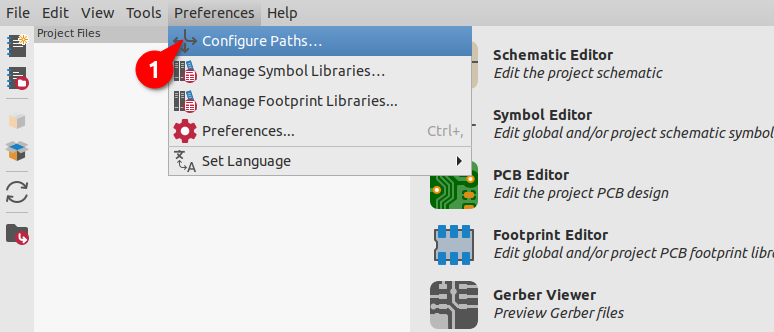
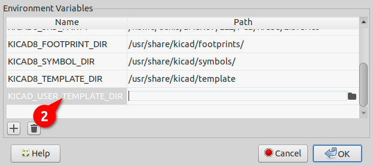
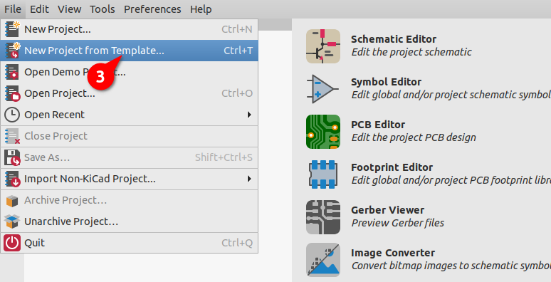
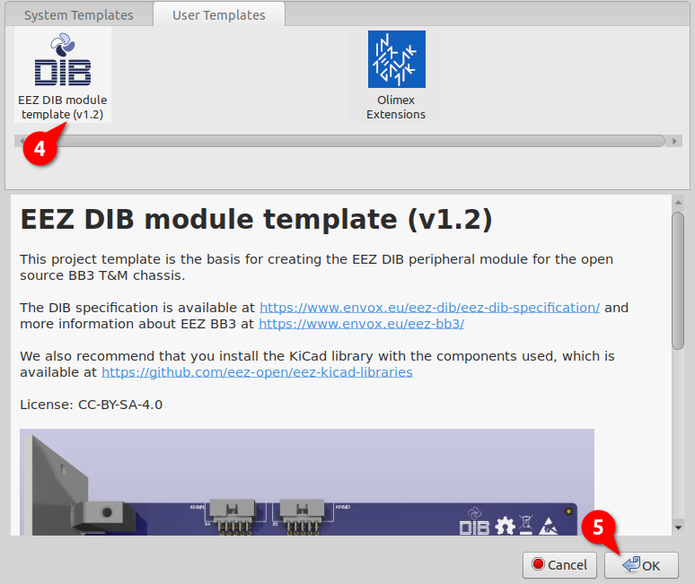
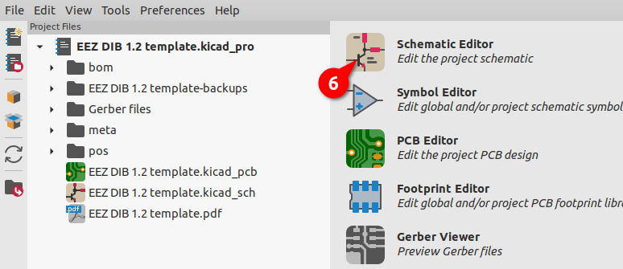
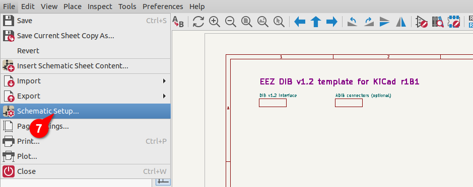
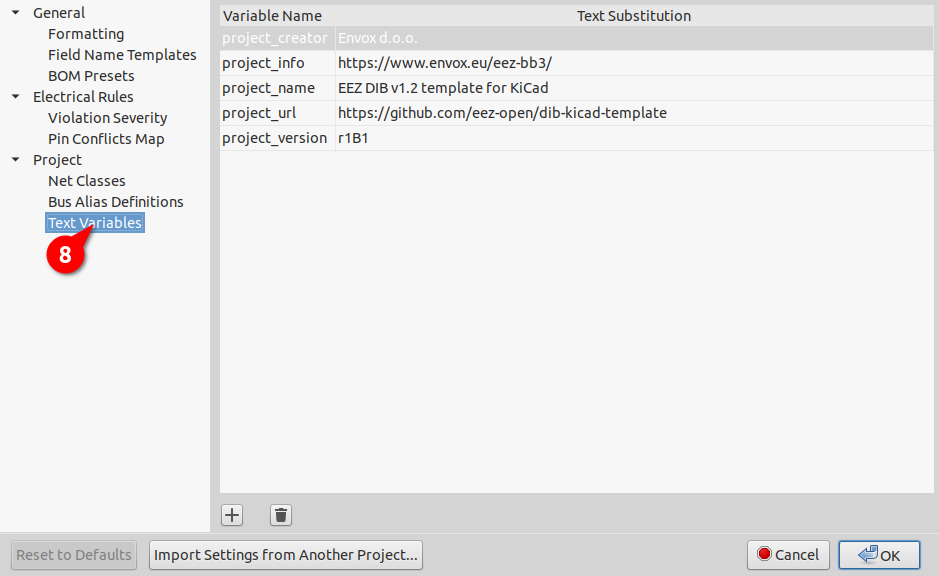

### KiCad project template for EEZ DIB peripheral modules

The project template makes it easy to start working on a new peripheral module and will need to be copied to your local KiCad template folder.

The template was created using symbols, footprints and 3D models from [eez-kicad-libraries](https://github.com/eez-open/eez-kicad-libraries), so for proper display it is recommended to install that plugin.

### Setting up the KiCad template folder

Start KiCad and in `Preferences` (1) open `Configure Paths...` (2) where you can see the currently configured Template path that you can change as desired.

### Copying a template and creating a new project from the template

Copy the complete contents of the template folder from this repository into it (e.g. `v1.2`)

Now you are ready to use the EEZ DIB template for your new project. To do this, you will need to select the `New Project from Template...` option from the `File` menu (3).

Under the `User Templates` tab, find the EEZ DIB template (4) and confirm the selection with `OK` (5).

### Setting project text variables

The new project is created and you can change the predefined texts as desired by first opening the `Schematic Editor` (6).

In the `File` menu of the Schematic Editor, select the option `Schematic Setup...` (7) and under `Text Variables` (8) you can see the values ​​of the text variables that were used and change them as desired.

Good luck and we wish you successful development. Feel free to keep us updated on your progress and contact us if you need further help with the EEZ DIB!

### About KiCad

KiCad is a Cross-Platform free and Open Source Electronics Design Automation Suite. See [KiCad EDA](https://kicad.org/) for more information.
